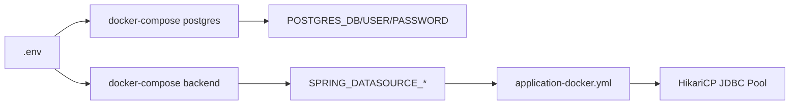

# Credenciales de Base de Datos — MicroCheck

**DBA:** Leonardo Falconí

---

## Variables de entorno (`.env`)

| Variable | Descripción | Valor ejemplo |
|---|---|---|
| `DB_NAME` | Nombre de la base de datos | `monitoring` |
| `DB_USER` | Usuario PostgreSQL | `postgres` |
| `DB_PASSWORD` | Contraseña PostgreSQL | *(definida en .env, no en código)* |

---

## Flujo de inyección de credenciales



1. **`.env`** define `DB_NAME`, `DB_USER`, `DB_PASSWORD`.
2. **Servicio `postgres`** en [`docker-compose.yml`](../../docker-compose.yml) mapea:
   - `POSTGRES_DB: ${DB_NAME}`
   - `POSTGRES_USER: ${DB_USER}`
   - `POSTGRES_PASSWORD: ${DB_PASSWORD}`
3. **Servicio `backend`** inyecta:
   - `SPRING_DATASOURCE_URL: jdbc:postgresql://postgres:5432/${DB_NAME}`
   - `SPRING_DATASOURCE_USERNAME: ${DB_USER}`
   - `SPRING_DATASOURCE_PASSWORD: ${DB_PASSWORD}`
4. **[`application-docker.yml`](../../backend/src/main/resources/application-docker.yml)** consume esas variables sin defaults inseguros en password.

---

## Buenas prácticas aplicadas

- Credenciales **nunca** en código fuente Kotlin/SQL.
- PostgreSQL **no expone** puerto 5432 al host (solo red interna `microcheck-network`).
- Volumen `postgres_data` persiste datos entre reinicios del contenedor.
- Perfil docker usa `ddl-auto: validate` — Hibernate no modifica credenciales ni esquema.

---

## Comandos de conexión (auditoría en vivo)

Desde el host, acceder al contenedor:

```powershell
docker exec -it monitoring-db psql -U postgres -d monitoring
```

Verificar usuario activo y base de datos:

```sql
SELECT current_user, current_database();
```

---

## Nota de seguridad

El archivo `.env` está incluido en el repositorio para la exposición académica del proyecto (entorno de demostración único). Las credenciales se inyectan a los contenedores vía Docker Compose y no están hardcodeadas en el código fuente.
