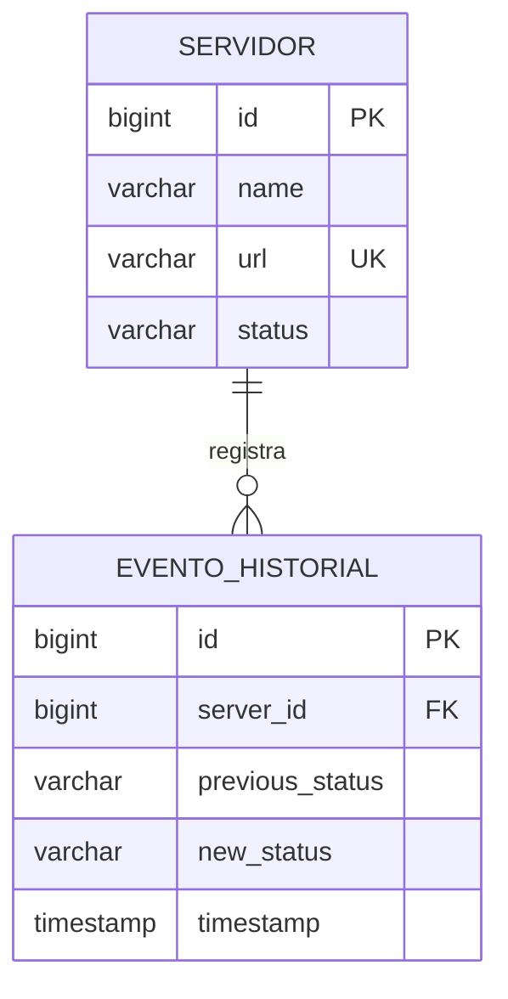

# Diseño de Base de Datos — MicroCheck

**Proyecto:** MicroCheck - Sistema de Monitoreo de Servidores y Alertas  
**DBA:** Leonardo Falconí  
**Motor:** PostgreSQL 17-alpine  
**Fecha:** 2026-06-06

---

## 1. Modelo conceptual

El sistema persiste dos conceptos:

- **Servidor:** recurso monitoreado (nombre, URL, estado actual).
- **Evento de historial:** registro de un cambio de estado con timestamp.

---

## 2. Modelo lógico

| Entidad | Descripción |
|---|---|
| `servers` | Catálogo de servicios monitoreados |
| `server_history` | Log de transiciones de estado |

**Cardinalidad:** `servers` (1) → (N) `server_history`

---

## 3. Modelo relacional (físico)

Script fuente: [`database/init/01-schema.sql`](../../database/init/01-schema.sql)

### Tabla `servers`

| Columna | Tipo | Restricciones |
|---|---|---|
| `id` | BIGSERIAL | PK |
| `name` | VARCHAR(255) | NOT NULL |
| `url` | VARCHAR(255) | NOT NULL, UNIQUE |
| `status` | VARCHAR(255) | NOT NULL, DEFAULT 'UNKNOWN', CHECK enum |

### Tabla `server_history`

| Columna | Tipo | Restricciones |
|---|---|---|
| `id` | BIGSERIAL | PK |
| `server_id` | BIGINT | NOT NULL, FK → servers(id) ON DELETE CASCADE |
| `previous_status` | VARCHAR(255) | NOT NULL, CHECK enum |
| `new_status` | VARCHAR(255) | NOT NULL, CHECK enum |
| `timestamp` | TIMESTAMP(6) | NOT NULL, DEFAULT CURRENT_TIMESTAMP |

**Valores enum permitidos:** `ONLINE`, `OFFLINE`, `UNKNOWN`

---

## 4. Diccionario de datos

### `servers`

| Campo | Descripción |
|---|---|
| `id` | Identificador autoincremental del servidor |
| `name` | Nombre descriptivo mostrado en el panel |
| `url` | URL HTTP/HTTPS a monitorear (única en el sistema) |
| `status` | Estado actual: ONLINE, OFFLINE o UNKNOWN |

### `server_history`

| Campo | Descripción |
|---|---|
| `id` | Identificador del evento de historial |
| `server_id` | Referencia al servidor afectado |
| `previous_status` | Estado antes del cambio |
| `new_status` | Estado después del cambio |
| `timestamp` | Momento exacto del cambio (requerido por PMV) |

---

## 5. Relaciones y reglas de negocio

1. Cada servidor tiene una URL única (`uq_servers_url`).
2. El scheduler registra historial solo cuando cambia el estado.
3. El PMV exige registrar **URL + hora de caída** → mapeado a filas con `new_status = 'OFFLINE'` y `timestamp`.
4. Al eliminar un servidor, su historial se elimina en cascada (`ON DELETE CASCADE`).
5. Estados inválidos son rechazados por CHECK constraints.

---

## 6. Índices y rendimiento

| Índice | Columnas | Propósito |
|---|---|---|
| `idx_server_history_server_id` | `server_id` | Consultas por servidor (`GET /api/history/{serverId}`) |
| `idx_server_history_timestamp_desc` | `timestamp DESC` | Historial global ordenado |
| `idx_server_history_offline_events` | `server_id, timestamp DESC` WHERE `new_status='OFFLINE'` | Consultas de caídas |

Para el volumen del PMV (<100 servidores, checks cada 30s), este diseño es suficiente.

---

## 7. Alineación con entidades JPA

| JPA (`Server.kt`) | PostgreSQL |
|---|---|
| `id` | `servers.id` |
| `name` | `servers.name` |
| `url` | `servers.url` |
| `status` | `servers.status` |

| JPA (`ServerHistory.kt`) | PostgreSQL |
|---|---|
| `id` | `server_history.id` |
| `serverId` | `server_history.server_id` |
| `previousStatus` | `server_history.previous_status` |
| `newStatus` | `server_history.new_status` |
| `timestamp` | `server_history.timestamp` |

Hibernate en perfil `docker` usa `ddl-auto: validate` — el esquema lo gobierna el DBA vía scripts SQL.
